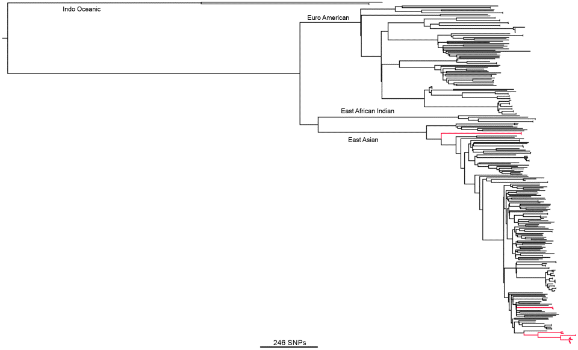

## Whole Genome Sequencing of Mycobacterium tuberculosis clinical isolates

The treatment of drug-resistant tuberculosis cases is challenging, as drug options are limited, and the existing diagnostics are inadequate. Whole-genome sequencing (WGS) has been used in a clinical setting to investigate six cases of suspected extensively drug-resistant Mycobacterium tuberculosis (XDR-TB) encountered at a London teaching hospital between 2008 and 2014. Sixteen isolates from six suspected XDR-TB cases were sequenced; five cases were analyzed in a clinically relevant time frame, with one case sequenced retrospectively. WGS identified mutations in the M. tuberculosis genes associated with antibiotic resistance that are likely to be responsible for the phenotypic resistance. Thus, an evidence base was developed to inform the clinical decisions made around antibiotic treatment over prolonged periods. All strains in this study belonged to the East Asian (Beijing) lineage, and the strain relatedness was consistent with the expectations from the case histories, confirming one contact transmission event. We demonstrate that WGS data can be produced in a clinically relevant time scale some weeks before drug sensitivity testing (DST) data are available, and they actively help clinical decision-making through the assessment of whether an isolate (i) has a particular resistance mutation where there are absent or contradictory DST results, (ii) has no further resistance markers and therefore is unlikely to be XDR, or (iii) is identical to an isolate of known resistance (i.e., a likely transmission event). A small number of discrepancies between the genotypic predictions and phenotypic DST results are discussed in the wider context of the interpretation and reporting of WGS results.

 

 
Witney AA, Gould K, Butcher PB, Cubbon M, Breathnach A, Pope C, Bolt F, Hinds J, Planche T. (2014) Genome sequencing and characterization of an XDR ST111, serotype O12 outbreak strain of Pseudomonas aeruginosa. Clin Microbiol Infect. 20(10):O609-18.

 
[https://www.ncbi.nlm.nih.gov/pubmed/25673793](https://www.ncbi.nlm.nih.gov/pubmed/25673793)
